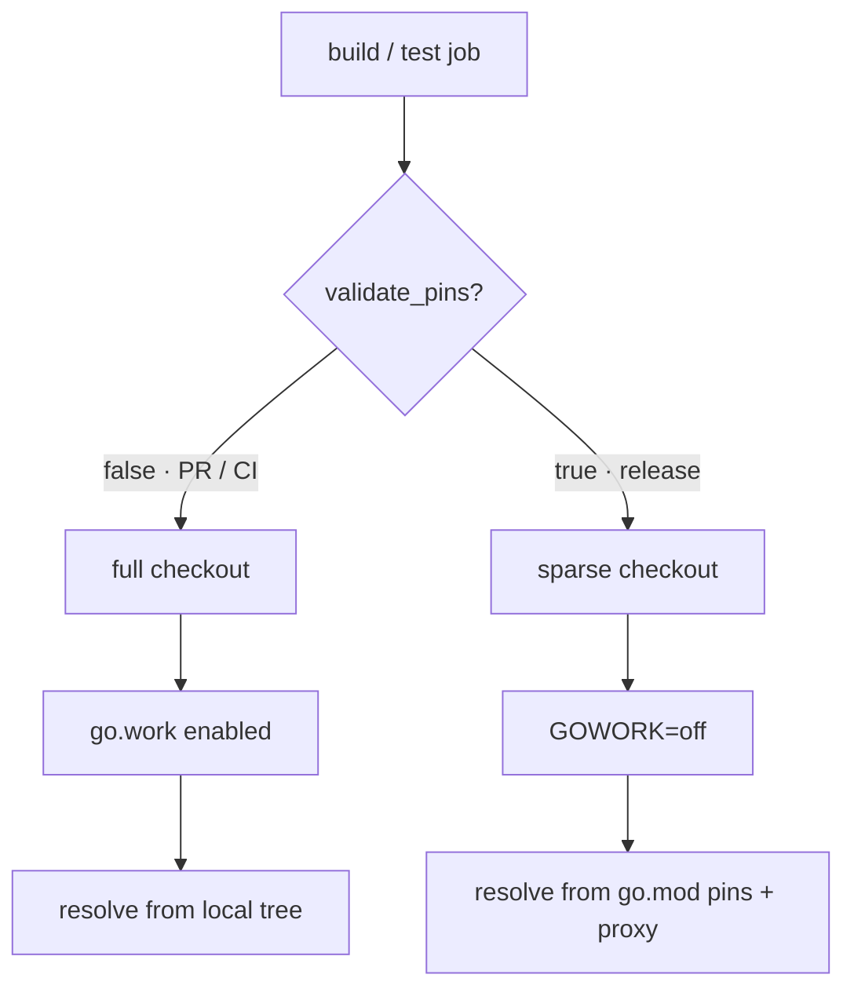
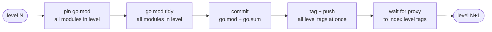

# ADR: Bindings CI and Release Strategy

* **Status**: proposed
* **Deciders**: OCM Technical Steering Committee
* **Date**: 2026-06-22
* **Last updated**: 2026-06-30 — `go.work` is committed and authoritative (was git-ignored/generated).

---

## Context

The OCM monorepo maintains 20+ independently versioned Go binding modules under `bindings/go/*` (CEL, Helm, OCI,
sigstore, …). They depend on each other (many import `bindings/go/credentials` or `bindings/go/oci`) and are consumed
by the top-level `cli` and `kubernetes/controller` modules.

Treating each binding as its own module is correct for external consumers — they can pin a single binding at a specific
version — but the tooling around that boundary created friction we needed to remove. Four problems had to be solved:

1. **Cross-module PRs.** A change spanning several bindings used to require a sequential chain: merge and release the
   base binding, then open a PR pinning it in the next binding, and so on. Reviewers saw each step out of context.
2. **Cross-module regressions.** A change to `bindings/go/credentials` can break `bindings/go/helm` or `cli`; testing
   only the changed module misses this.
3. **Workspace consistency.** The repo-wide `go.work` must reflect the checked-out tree so workspace-aware commands
   resolve every dependency locally.
4. **Coordinated releases.** Bindings must be released in dependency order; releasing them ad-hoc leaves dependents
   pinned to stale versions.

**Out of scope:** per-component release versioning (see [ADR 0010](0010_release_strategy.md)).

---

## Decisions

| Area | Chosen | Rejected | Why |
|---|---|---|---|
| **Module structure** | Keep per-binding `go.mod`; add a **committed `go.work`** as the source of truth for local + CI resolution | Fold all bindings into one shared library | Keeps independent versioning so external consumers take only what they need. The friction was in the tooling, not the boundary model; `go.work` removes the multi-PR chain without losing the boundary. |
| **CI test selection** | **Graph-aware filtering**: test changed modules + all direct/indirect dependents | Always test every binding | The dependency graph from `go.mod` gives an exact affected set, so cross-module regressions are still caught without paying the full test cost on every PR. |
| **Release** | **Automated phased bulk release** (`release-bindings.yaml`): plan → test → gate → release in dependency order | Manual per-module release as the primary path | Guarantees dependency ordering, gates on human review before any tag is pushed, and pins consumers atomically. Manual release is kept as an escape hatch for isolated fixes and bootstrapping. |

**Consequence:** every PR runs the affected binding tests against the local workspace, trading some CI compute for
correctness and a single-PR developer flow. The phased release provides the ordering and consistency guarantees the
manual path cannot.

---

## PR vs release builds

The same workflows run in two modes, switched by a single `validate_pins` input. PR/CI builds resolve against the
committed workspace; release builds disable it to prove the published `go.mod`/`go.sum` pins are correct on their own.

| | PR / CI build | Release build |
|---|---|---|
| Triggered by | `pull_request`, push to `main` | `release.yml` (tagged) → `pipeline.yml` |
| `validate_pins` | `false` | `true` |
| Workspace | committed `go.work` — **enabled** | **`GOWORK=off`** |
| Checkout | full — every module on disk | sparse — only the built module/scenario |
| Deps resolve from | local module tree via the workspace | `go.mod`/`go.sum` pins + module proxy |
| `go.mod` pins | may be stale; shadowed by the workspace | authoritative; this build validates them |
| Proves | in-flight cross-binding changes compile and test together, no tags needed | a `go get` consumer gets a correct, complete build |



**One PR-time exception.** Renovate's `ocm-monorepo` group PRs bump internal binding pins, so they run
`validate_pins=true` (`GOWORK=off`) even though they are PRs — otherwise the workspace would shadow the very pins the
PR is changing. They keep a full checkout; only the workspace is disabled. See *Renovate pin-validation* below.

---

## The go.work model

### Why go.work is committed

`go.work` and `go.work.sum` are committed and are the source of truth for cross-module resolution in local development
and CI. On `main` and feature branches the binding `go.mod` files do not necessarily pin each other at consistent
versions — the workspace redirects every internal import to the local tree, so the committed `go.work` is what makes
the monorepo build coherently. `go.mod` pins only become authoritative at release time.

When a module is added or removed, the committed `go.work` must be updated (`go work use ./<module>`) in the same
change. If it drifts from the module tree, workspace-mode CI fails loudly — `go.work` is the source of truth, not a
generated file. The `task init/go.work` task is kept only as a local bootstrap helper (regenerate from scratch); CI
never needs it because the committed file is already present after checkout.

### Checkout strategy

Workspace-mode jobs use a **full** checkout because the committed `go.work` references every module directory and Go
fails on missing paths. Sparse checkout is used only by **pin-validation** jobs (`GOWORK=off`), which resolve from
`go.mod`/`go.sum` + proxy and so need only the target module present.

| Job | Checkout | Workspace |
|---|---|---|
| `golangci_lint` | full | committed `go.work` |
| `test-bindings` unit | full | committed `go.work` |
| `test-bindings` unit (pin-validate) | full | `GOWORK=off` (Renovate PRs) |
| `test-bindings` integration | full | committed `go.work` |
| `cli` / controller build | full | committed `go.work` |
| `cli` / controller build (release) | sparse (module + scripts) | `GOWORK=off` (validate pins) |
| `e2e`, `conformance` | full | committed `go.work` |
| `e2e`, `conformance` (release) | sparse (scenario only) | `GOWORK=off` (validate pins) |

### go.sum correctness and the one known gap

Because the workspace is authoritative, `go.mod`/`go.sum` pins are **not** required to be standalone-consistent on
every commit — `go.work` shadows them. Standalone correctness (a pure `go get` resolution) is enforced at exactly two
points:

* **Release tags** — the release build runs `GOWORK=off`, so a binding tag can only be cut from a commit whose
  `go.mod`/`go.sum` are complete.
* **Renovate `ocm-monorepo` PRs** — run `GOWORK=off` so a bad pin fails before merge.

> **Known gap — `go.mod` consistency on `main`.** Between those two points, `go.work` masks stale pins: a drift
> introduced on an ordinary feature PR is invisible until the next release or Renovate PR. There is no general
> `GOWORK=off` check on `main` today. If it becomes a problem, add a periodic or push-to-`main` job that runs
> `go mod tidy` with `GOWORK=off` across all modules and fails on a diff. (Open question from the 29.06.2026 design
> discussion.)

---

## Release pipeline

### Phased bulk release

`release-bindings.yaml` runs four ordered phases:

1. **Plan** — discover all binding modules, topologically sort them by the `go mod edit -json` dependency graph, run
   change detection per module, compute next semver tags, and flag breaking changes from Conventional Commit markers
   (`feat!:`, `BREAKING CHANGE:`).
2. **Test** — run unit and integration tests for every changed module in parallel.
3. **Gate** — environment approval: a reviewer sees the full plan (changed modules, next tags, bump kinds, changelogs)
   and test results before any tag is pushed.
4. **Release** — process one dependency level at a time (below), then pin and tidy `cli` and `kubernetes/controller`
   in a final commit.

**Change detection.** A binding is scheduled for release when at least one commit touched its directory since its last
semver tag (`git log <lastTag>..HEAD -- bindings/go/<module>`). `lastTag` is the highest `bindings/go/<module>/v*` tag
in the repo (including tags fetched from upstream). A module with no prior tag is never auto-released — see *New binding
lifecycle*.

### Why one dependency level at a time

There is a hard ordering constraint: to write `blob/go.sum`'s checksum for `runtime@v0.0.9`, the toolchain must fetch
`runtime@v0.0.9` from the proxy — but the proxy only serves it after `runtime/v0.0.9` is tagged and pushed. Tagging a
version and consuming it cannot happen in one step. So the release walks the graph level by level:



Modules within a level share no intra-level dependency, so they pin, tidy, commit, and tag together. By the time level
N runs, levels 0..N-1 are already on the proxy, so `go mod tidy` can fetch their checksums, and each tag points to a
commit whose `go.sum` is complete. After all binding levels, `cli` and `kubernetes/controller` are pinned and tidied
in a final commit — by then every binding tag exists on the proxy.

**Dependency version resolution** is uniform regardless of whether a dep was released this run:

* released this run → use the new tag from `planRelease`;
* unchanged but previously tagged → use its current latest tag (stays current with out-of-band releases);
* never tagged → skip (*New binding lifecycle*).

### New binding lifecycle

A never-tagged binding is skipped by `planRelease` (`(no prior tag; skipped)` in the gate summary) and gets no tag. It
is still usable meanwhile: dependents reference it by Go pseudo-version (`v0.0.0-<timestamp>-<commit>`), which the
workspace makes transparent locally. To promote it:

1. merge its implementation to `main`;
2. manually trigger `release-go-submodule.yaml` to cut its initial tag (e.g. `bindings/go/newbinding/v0.0.1`);
3. from the next bulk release on, `planRelease` manages it normally.

Promotion is therefore an explicit act, not a side-effect of the first bulk release that touches the binding.

### Manual release and its consistency window

The manual per-module release (`release-go-submodule.yaml`) stays available for isolated fixes and bootstrapping. Its
limitation: if `bindings/go/helm` depends on `bindings/go/credentials` and you manually release `credentials@v1.2.0`,
`helm`'s `go.mod` still pins the old version until a follow-up PR. Locally `go.work` hides this, but a `go get` consumer
gets a mixed build until the pin is updated. The `concurrency: group: binding-release` guard prevents concurrent
releases from racing but does not close this window — which is why the phased bulk release is the canonical path.

---

## Implementation notes

### Module discovery and the affected set

`ci.yml`'s `discover_modules` pre-job runs on every push and PR:

1. enumerate all Go modules in the workspace;
2. build the full dependency graph across all modules (`go mod edit -json`) — bindings, `cli`,
   `kubernetes/controller`, and anything else in the workspace;
3. detect changed modules from `git diff --name-only origin/main...HEAD`;
4. walk the graph forward (dependents direction) to get the **affected set** = changed modules ∪ their transitive
   dependents;
5. filter to binding modules for the unit/integration matrices (`cli` and `kubernetes/controller` have their own
   workflows and are excluded);
6. emit the affected sets for unit tests, integration tests, and lint.

**Why graph-change-based, not path-change-based.** A path filter (`dorny/paths-filter`) only knows *which files
changed*, not *which modules those changes can break*. Catching cross-module regressions with it would mean
hand-maintaining expansion rules that mirror the import graph — exactly the dependency relationships `go.mod` already
declares. Now that a single PR can change a binding and its dependents together (the workspace makes this possible —
the friction this epic removed), the set of modules a change touches is no longer "the directory the diff lands in." We
derive the affected set from the actual dependency graph instead, so a new edge or a new binding is picked up
automatically with no rule to keep in sync.

### Dependency graph and topological sort

`buildGraph` in `.github/scripts/release-bindings.js` derives the graph from `go.mod` via the toolchain (not regex), so
replace directives, indirect markers, and multi-line blocks are all handled correctly:

```js
// internal binding deps of a module, from `go mod edit -json`:
internalDeps = Require
  .map(r => r.Path)
  .filter(p => p.startsWith('ocm.software/open-component-model/bindings/go/'));

// Kahn's algorithm — deps precede their dependents:
ordered = topoSort(modules, depsMap);
```

### Renovate pin-validation

Renovate's `ocm-monorepo` group bumps internal binding pins across `go.mod` files. With the workspace active those PRs
would pass even with a wrong pin, because the workspace resolves bindings from disk. When the branch matches
`renovate/ocm-monorepo*`, `discover_modules` sets `validate_pins: true` and both the unit and integration matrices run
`GOWORK=off`, so a bad pin fails. Detection is tied to the group slug (`groupSlug: 'ocm-monorepo'` in `renovate.json5`)
— no `go.mod` parsing needed.

### Consumer trigger

`cli` and `kubernetes/controller` tests are triggered by the affected-set computation, not a static path filter: a
binding change reaches them through the import graph, while an unrelated binding change does not. `pipeline.yml`'s path
filter still triggers the full consumer build on direct changes to `cli/**` or `kubernetes/controller/**`.

---

## Alternatives considered

Two established multi-module release toolchains were evaluated and rejected — Kubernetes `publishing-bot`
(separate-repo mirroring plus a hand-maintained DAG; institutional baggage we don't share) and OpenTelemetry
`multimod`/`crosslink` (regex `go.mod` rewriting and a `versions.yaml` that needs operator edits every release).
`crosslink`'s `go.mod`-derived topo-sort is the same approach as our `buildGraph`, confirming the direction.
