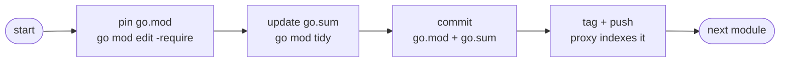

# ADR: Bindings CI and Release Strategy

* **Status**: proposed
* **Deciders**: OCM Technical Steering Committee
* **Date**: 2026-06-22

---

## Technical Story

The OCM monorepo maintains 20+ Go binding modules (`bindings/go/*`), small independently versioned Go modules that
wrap OCM capabilities for specific consumers (CEL, Helm, OCI, sigstore, …). These modules are interdependent (many
import `bindings/go/credentials` or `bindings/go/oci`) and also consumed by top-level modules (`cli`,
`kubernetes/controller`).

The independent-module setup was creating significant friction across the team:

* PR overhead: a single logical change (e.g., adding a new credential type that spans multiple bindings) required
  a strict sequential chain: merge a PR for the base binding, release it, then open the next PR for the dependent
  binding combining the `go.mod` pin update with the functional changes, merge it, release it, and repeat for every
  binding in the dependency chain. Reviewers saw each PR in isolation without the context of the broader change, making
  review harder and slower.
* **CI complexity**: the initial CI design used change-based filtering to avoid running all binding tests on every PR.
  This required `dorny/paths-filter`, separate signals for `.env` and CI workflow changes, and special-cased expansion
  rules to catch cross-module regressions.

The friction was in the tooling around the module boundary model, not in the model itself. This ADR documents the
multiple
candidate directions evaluated and explains how the chosen approach resolves each pain point.

### Context and Problem Statement

Four concrete problems had to be solved:

1. **Cross-module pull-requests**: changes relating to multiple bindings can now be provided in one PR instead of having
   a PR per binding change with binding releases in-between.
2. **Cross-module regressions**: a change to `bindings/go/credentials` can silently break `bindings/go/helm` or `cli` if
   only the changed module is tested.
3. **Workspace management**: the repo-wide `go.work` at the root is always present during development or is generated
   within the CI workflows.
   It must reflect the checked-out tree so that workspace-aware commands resolve all dependencies locally during
   development and CI.
4. **Coordinated releases**: bindings must be released in dependency order. A manual per-module release can leave
   dependent modules in an inconsistent state.

### Out of scope

* Per-component release versioning (covered by [ADR 0010](0010_release_strategy.md)).

---

## Decision Drivers

* CI must catch cross-module regressions, not just single-module failures.
* Developer UX must allow cross-binding pull-requests without the need to release a binding in-between.
* `cli` and `kubernetes/controller` have dedicated build/release workflows and must not be polluted by binding CI.
* Binding releases must respect dependency order and leave consumers (`cli`, `kubernetes/controller`) in a consistent
  pinned state.

---

## Options

### Structural direction

* **Keep Go modules, improve tooling**: retain independent `go.mod` per binding and use `go.work` (git-ignored,
  generated in CI and locally via `task init/go.work`) to fix CI. This reduces PR friction without changing
  the module boundary model.
* **Ditch Go modules, shared library**: remove per-binding `go.mod` files and fold all bindings into a single shared
  library consumed directly by `cli` and `kubernetes/controller`. Eliminates the boundary model entirely.

### CI strategy

* **Graph-aware change-based filtering**: on PR, build the full dependency graph from `go.mod` files, detect
  which modules changed, and test the changed modules plus every direct and indirect dependent.
* **Always test all bindings**: test every binding on every PR regardless of what changed.

### Release strategy

* **Manual per-module release** via `release-go-submodule.yaml`.
* **Automated phased bulk release** via `release-bindings.yaml` (plan, test, gate, release).

---

## Decision Outcome

Keep Go modules with a git-ignored `go.work`, use graph-aware change-based filtering in CI, and use the automated
phased bulk release as the canonical path. The manual per-module release is retained for isolated fixes and for
bootstrapping new bindings. All CI jobs use a full checkout with `go.work` enabled.

**Why keep Go modules over a shared library:** Ditching Go modules would eliminate independent versioning, making it
impossible for external consumers to take only the bindings they need at a specific version. The binding boundary model
has value; the friction was in the tooling around it, not in the model itself. Adding `go.work` recovers the
developer-experience benefit without sacrificing the boundary model.

**Why graph-aware filtering over always-test-all:** Testing every binding on every PR wastes compute on changes
that cannot affect unrelated modules. The dependency graph derived from `go.mod` files gives an exact affected set —
the changed modules plus all direct and indirect dependents. This keeps feedback fast without sacrificing regression
coverage, because a module is only skipped when the graph proves it cannot be affected.

**Why the phased bulk release over manual per-module releases:** A phased bulk release computes next tags in
dependency order, runs tests, requires human review of the plan before any tags are pushed, and pins consumer
`go.mod` files (`cli`, `kubernetes/controller`) atomically. Manual per-module releases cannot guarantee dependency
ordering and create a consistency window (see *Release Strategy* below). The manual workflow is kept as an escape
hatch for isolated fixes and for bootstrapping new bindings.

---

## Pros and Cons

### Structural direction

**Keep Go modules with go.work (selected)**

* **Pros:** Preserves independent versioning so external consumers can depend on specific binding versions.
  `go.work` eliminates multi-PR sequential chains during development.
* **Cons:** Still requires a release workflow that understands dependency order. `go.work` must be regenerated
  when modules are added or removed.

**Ditch Go modules, shared library (not selected)**

* **Pros:** Zero release friction, no dependency ordering, and a single `go.mod` for the whole codebase.
* **Cons:** Loses independent versioning entirely. External consumers must take the entire library at a single version.
  Breaking changes affect all consumers simultaneously with no opt-in period. Contradicts the binding design goal of
  composability.

### CI strategy

**Graph-aware change-based filtering (selected)**

* **Pros:** Only the affected modules run on any given PR. The dependency graph derived from `go.mod` gives an
  exact affected set — changed modules plus all direct and indirect dependents — so cross-module regressions
  are still caught. New bindings are automatically included when they appear in the graph. `cli` and
  `kubernetes/controller` are included when any of their binding imports are in the affected set, or when
  their own code changes.
* **Cons:** Requires building the dependency graph on every PR. Modules with no graph path to the changed code
  are skipped, so a regression that manifests only at runtime without a compile-time dependency would be missed.

**Always test all bindings (not selected)**

* **Pros:** Guaranteed to catch any regression regardless of dependency structure.
* **Cons:** Every code-touching PR pays the full test cost even for unrelated changes, which grows linearly with
  the number of bindings.

### Release strategy

**Phased bulk release (selected as canonical path)**

* **Pros:** Dependency order is guaranteed, a human review gate runs before any tags are pushed, and consumers
  are pinned atomically.
* **Cons:** More complex workflow that requires a plan step to probe the dependency graph.

**Manual per-module release (kept for isolated fixes and bootstrapping)**

* **Pros:** Simple workflow where the developer controls exactly which version is released and when.
* **Cons:** No dependency ordering, which creates a consistency window between dependent modules (see below).

---

## go.work Management

### Why go.work is not committed

`go.work` is listed in `.gitignore` and generated in CI via `task init/go.work`. This avoids the problem of a
committed `go.work` referencing all 20+ modules while a sparse checkout only has a subset — Go tooling would fail
on missing paths. By generating `go.work` after checkout, the workspace is automatically scoped to the checked-out
tree.

`discoverModules()` in the workflow script reads the workspace via `go work edit -json` to
enumerate all binding modules without any hardcoded list.

The authoritative Go version is stored in `.go-version` (repo root). All CI jobs that need a workspace use:

```sh
# 1. actions/setup-go with go-version-file: .go-version
# 2. arduino/setup-task
# 3. task init/go.work   # go work init + go work use for all checked-out go.mod files
```

`task init/go.work` uses `status: find go.work` so it is a no-op if the file already exists, but since it is
git-ignored it will never be present after a fresh checkout.

### Checkout strategy

All CI jobs that run binding or consumer tests use a full repository checkout so that `go.work` covers the
complete module tree. Sparse-checkout is not used for test jobs — the workspace must see all modules to resolve
cross-binding imports correctly.

| Job                           | Checkout      | Workspace           |
|-------------------------------|---------------|---------------------|
| `golangci_lint`               | full          | `task init/go.work` |
| `test-bindings` unit          | full          | `task init/go.work` |
| `test-bindings` integration   | full          | `task init/go.work` |
| `cli` build (release)         | `cli/` only   | none (go.mod only)  |
| `kubernetes-controller` build | controller only | none (go.mod only) |
| `e2e`, `conformance`          | module + config | none              |

---

## Release Strategy

### Consistency window in manual per-module releases

If `bindings/go/helm` depends on `bindings/go/credentials` and a developer manually releases
`bindings/go/credentials@v1.2.0`, the `go.mod` of `bindings/go/helm` still pins the old version until a follow-up
PR updates it. During that window, `bindings/go/helm` is internally consistent via `go.work` in local development,
but its published `go.mod` references the old API. Any consumer resolving via `go get` (not `go.work`) gets a mixed
build. The `concurrency: group: binding-release` guard prevents concurrent releases from racing but does not close
this window.

### Change detection

A binding is scheduled for release when there is at least one commit that touched its directory since its
last semver tag:

```
git log <lastTag>..HEAD -- bindings/go/<module>
```

`lastTag` is the highest semver tag matching `bindings/go/<module>/v*` found in the repository (including
tags fetched from upstream). A module with no prior tag at all is never considered for automatic release.
See *New binding lifecycle* below.

### go.sum correctness requirement

The monorepo must build correctly with or without `go.work` — in feature branches, in sparse checkouts, and
for contributors who have not yet run `task init/go.work`. This means every binding tag must point to a commit
where `go.mod` and `go.sum` are both correct and complete for that module's declared dependencies.

This creates a fundamental ordering constraint: to update `blob/go.sum` with a checksum for `runtime@v0.0.9`,
the Go toolchain needs to fetch `runtime@v0.0.9` from the module proxy. But the proxy only serves it after
the `runtime/v0.0.9` tag has been pushed. The two operations cannot happen in the same step.

### Phased bulk release

`release-bindings.yaml` runs four ordered phases:

1. **Plan**: discover all binding modules and topologically sort them by the dependency graph derived from
   `go mod edit -json`. For each module, run the change detection above. Compute next semver tags for changed
   modules and detect breaking changes from Conventional Commit markers (`feat!:`, `BREAKING CHANGE:`).
2. **Test**: run unit and integration tests for every changed module in parallel.
3. **Gate**: environment approval — a reviewer sees the full plan (changed modules, next tags, bump kinds,
   changelogs) and test results before any tags are pushed.
4. **Release**: for each changed module in topological order — pin `go.mod`, update `go.sum`, commit, tag,
   push. Then pin and tidy `cli` and `kubernetes/controller` in a final commit.

The release phase processes one module at a time. Each tag is pushed before the next dependent module is
processed, so the proxy has the new version available when that module runs `go mod tidy`.

### Dependency pinning and go.sum update

For each changed binding module in topological order, the release does the following:



By the time a module is processed, all its dependencies have already been tagged and pushed in previous
iterations, so `go mod tidy` can fetch their checksums from the proxy. Each tag therefore points to a commit
where `go.sum` is complete and valid.

The dep version resolution follows the same logic regardless of whether a dep was released this run or
previously:

- **Released this run**: use the new tag computed by `planRelease`.
- **Skipped/unchanged with an existing tag**: use the current latest tag, so consumers stay current with
  upstream releases that happened outside the current run.
- **Never tagged**: skip. See *New binding lifecycle* below.

After all binding tags are pushed, `cli` and `kubernetes/controller` are pinned and tidied in a single
final commit. By that point all binding tags exist on the proxy, so their `go.sum` entries are also complete.

### go.work in the release build

PR and CI builds use `go.work` throughout so that in-flight binding changes resolve against the local tree without
requiring published tags.

Release builds (`cli.yml`, `kubernetes-controller.yml` called from `release.yml`) run with `GOWORK=off`. By the time
these builds run, `release-bindings.yaml` has already pushed all binding semver tags and committed correct `go.mod`
and `go.sum` files for every module. Disabling the workspace forces the build to resolve dependencies exclusively
from those pins and checksums — exactly what an external consumer gets via `go get`. This validates that the pins
and checksums are correct before the RC tag is created.

### New binding lifecycle

A binding that has never been tagged is skipped by `planRelease` — it appears in the gate summary as
`(no prior tag; skipped)` and receives no semver tag in the bulk release. During this pre-release period the
binding is still usable: dependents can reference it via a Go pseudo-version
(`v0.0.0-<timestamp>-<commit>`) which the Go toolchain derives from the commit SHA. In workspace mode
(`go.work`) this is transparent to developers — the local tree is used directly regardless of what version
is declared in `go.mod`.

When the binding is ready for stable versioning:

1. Merge the binding's implementation to `main`.
2. Manually trigger `release-go-submodule.yaml` targeting the new binding to create its initial tag
   (e.g., `bindings/go/newbinding/v0.0.1`).
3. From the next bulk release onwards, `planRelease` picks it up normally and `pinDeps` manages its consumers.

This makes the promotion of a new binding to stable versioning an explicit, intentional act rather than an
automatic side-effect of the first bulk release that touches it.

---

## Implementation

### Module discovery and affected-set computation

`ci.yml` runs a `discover_modules` pre-job on every push and PR:

1. Enumerate all binding modules from `go.work` via `go work edit -json`.
2. Build the full dependency graph from each module's `go.mod` using `go mod edit -json`.
3. Detect which modules have changed files in the PR (`git diff --name-only origin/main...HEAD`).
4. Walk the graph forward (dependents direction) from each changed module to find all direct and indirect
   dependents. The union of changed modules and their dependents is the **affected set**.
5. Determine whether `cli` is affected: `cli` changed directly, or any binding in the affected set is
   imported by `cli`.
6. Determine whether `kubernetes/controller` is affected: controller changed directly, or any binding in
   the affected set appears in controller's `go.mod` imports.
7. Output the affected binding set and the integration-test subset of it (modules with a `test/integration`
   Taskfile target), plus flags for whether `cli` and `controller` tests should run.

Lint always runs across the full workspace regardless of what changed. All test jobs use a full checkout
with `go.work` enabled so cross-binding resolution works without published tags. Adding a new binding under
`bindings/go/` automatically enrolls it in the graph and in all downstream test decisions with no config
change required.

### Dependency graph and topological sort

`buildGraph` in `.github/scripts/release-bindings.js` derives the dependency graph from `go.mod` files:

```js
// For each binding module:
internalDeps = go
mod
edit - json | Require[]
    .filter(path => path.startsWith("ocm.software/open-component-model/bindings/go/"))

// Topological sort (Kahn's algorithm) — deps precede their dependents
ordered = topoSort(modules, depsMap)
```

Using `go mod edit -json` (toolchain-authoritative) rather than regex parsing ensures all `go.mod` syntax
(replace directives, indirect markers, multi-line blocks) is handled correctly.

### Consumer trigger

Consumer tests (`cli`, `kubernetes/controller`) are triggered by the affected-set computation in `discover_modules`,
not by a static path filter. This means a binding change that reaches a consumer through the import graph triggers
that consumer's tests, while an unrelated binding change does not. The `pipeline.yml` path filter continues to
trigger the full consumer build pipeline on direct changes to `cli/**` or `kubernetes/controller/**`.

---

## External Alternatives Evaluated

Two established multi-module release toolchains were reviewed and rejected:

**Kubernetes `publishing-bot`** mirrors staging modules to separate read-only repos via `git filter-branch`.
Dependency ordering is declared in a hand-maintained `rules.yaml` DAG per module. Not applicable: the
separate-repo mirroring exists because Kubernetes module paths don't match their monorepo layout — institutional
baggage irrelevant to us. Their manually maintained DAG is strictly worse than our auto-derived ordering from
`go mod edit -json`.

**OpenTelemetry `multimod` + `crosslink`** — `multimod` bumps versions from a declarative `versions.yaml` and
rewrites `go.mod` files via regex. `crosslink` derives the topo-sort from `go.mod` parsing. Not adopted:
regex `go.mod` rewriting mishandles edge cases silently. `versions.yaml` requires operator edits on every
release. `multimod tag` is non-idempotent (open upstream bug). `crosslink`'s `go.mod`-derived topo-sort is
exactly what `buildGraph` does — it confirms our approach is correct prior art. We use `go mod edit -json`
(toolchain-authoritative) instead of regex.

---

## Conclusion

The chosen approach directly addresses each identified pain point:

* **PR overhead**: `go.work` (git-ignored, generated in CI and locally via `task init/go.work`) allows developers
  to make cross-binding changes in a single PR. The workspace ensures all interdependent modules resolve against
  the current tree, not published versions, so a change spanning `bindings/go/credentials` and `bindings/go/helm`
  can be reviewed and merged together.
* **CI complexity**: module discovery is two steps with no filtering logic. All
  binding tests always run, eliminating the correctness gaps that came with change-based filtering.
* **Release flow**: the existing release flow (`release.yml`) is extended to invoke `release-bindings.yaml` before
  tagging the CLI and controller. Binding tags are created automatically in dependency order as part of every
  release, with no manual steps required.

The approach trades CI compute (running all binding tests on every PR) for correctness and
simplicity. The phased bulk release with a human gate provides the ordering and consistency guarantees that manual
per-module releases cannot, while keeping the escape hatch for isolated fixes and new binding bootstrapping.
